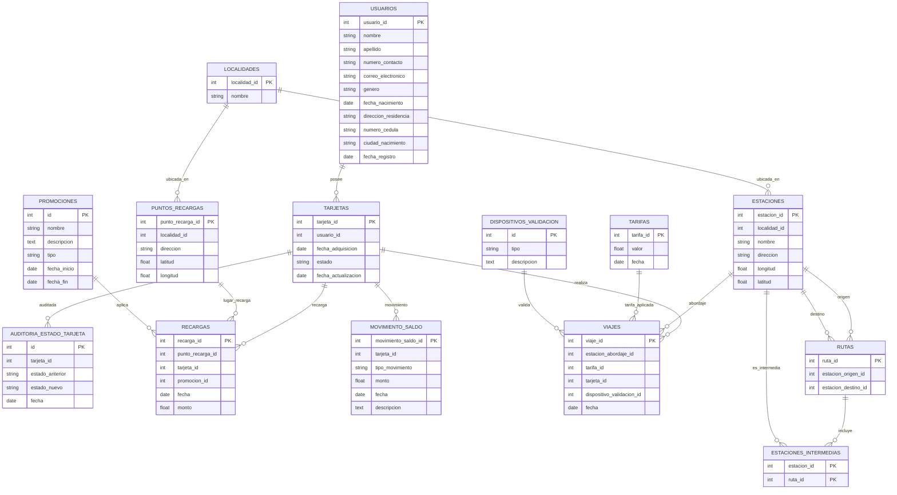

# Sistema de Recargas y Viajes de Transporte Público Requisitos y Mejoras
Este proyecto presenta el desarrollo y estructuración de una base de datos enfocada en el Módulo de Recargas y Viajes de un sistema de transporte público previamente implementado por el docente Cristhian Fernando Moreno Manrique, agregando los requisitos solicitados y una propuesta de mejora en la gestión de las recargas de tarjeta y llevar un control detallado de los trayectos realizados dentro del servicio de transporte masivo. La base de datos busca optimizar la experiencia del usuario al facilitar el registro y supervisión de sus operaciones y desplazamientos

**Nota:** Este trabajo tiene fines académicos y se ha desarrollado como parte de una práctica de diseño de bases de datos, por lo que no representa un sistema de transporte real

### Descripción General de las funciones implementadas
1. **Auditoría del estado de las tarjetas**
    
    Registrar cada cambio de estado de una tarjeta (por ejemplo, activa, bloqueada) con el fin de auditar su vida útil y detectar posibles modificaciones indebidas.
    
2. **Promociones aplicadas en recargas**
    
    Incorporar la posibilidad de registrar y consultar descuentos o bonos aplicados en las recargas, para mejorar la experiencia del usuario y facilitar el análisis comercial.

3. **Registro de dispositivos de validación**
    
    Almacenar información sobre qué dispositivo (torniquete, validador móvil, etc.) valida cada viaje, con fines de trazabilidad y estadísticas.

4. **Seguimiento de saldo de tarjeta**

    Registrar el saldo de cada tarjeta cada vez que ocurre una transacción que lo modifica, como una recarga o un viaje. Esta funcionalidad proporciona una trazabilidad completa del historial financiero de la tarjeta, permitiendo analizar cómo varía el saldo a lo largo del tiempo. Adicionalmente se integran las siguientes funcionalidades para el análisis del sistema
   - Total recargado por tarjeta en un rango de tiempo, en este caso en los últimos 3 meses
   - Historial de saldo con nombre del usuario
   - Tarjetas con más viajes y su saldo gastado en viajes
   
   
### Instrucciones para ejecutar los scripts

- En la carpeta db/data se encuentran en orden numerico cada uno de los archivos .sql
- En el archivo 001-schema.sql se encuentra la creación de cada tabla de la base de datos
- En el archivo 002-schema.sql se encuentra la modificación de las tablas originales necesarias para la implementación de los requerimientos planteados y las mejoras, allí se encuentran las sentencias "Alter Table"
- Desde el archivo 003 al 014 se encuentran las sentencias "Insert Into", las cuales se encargan de insertar los datos para cada tabla
- Finalmente, en el archivo consultas.sql, se encuentra las consultas que satisfacen los requerimientos del sistema y se encuentra la propuesta de mejora del sistema

### Resumen de las tablas modificadas

- Se modifica la tabla recargas agregando una columna que relaciona como llave foránea el tipo de promoción que corresponda (bonos o descuentos)
- Se modifica la tabla viajes agregando una columan que relaciona como llave foránea el dispositivo con el cual se valido el pasaje (torniquete o validador móvil)
- Se crea la tabla auditoria_estado_tarjeta, esta se encarga de cambiar el estado de las tarjetas existentes, siendo este su campo clave y guardar un registro de la fecha de modificación
- Se crea la tabla prmociones, esta se encarga de almacenar las promociones existentes del sistema, siendo su campo clave el tipo de promoción, adicionalmente cuenta con una fecha de inicio y de final
- Se crea la tabla dispositivo, esta se encarga de almacenar los dispositivos utilizados para validar cada uno de los viajes, siendo su campo clave el tipo de dispositivo
- Se crea la tabla movimientos_saldo, esta relaciona el ID de la tarjeta y almacena las transacciones realizadas, ya sea una recarga, un viaje o un ajuste del sistema, siendo este su campo clave  esto permite llevar un monitoreo de todas las transacciones que realiza un usuario

### Descripción del tipo de datos insertados

- Mayormente se insertan datos del tipo entero, considerando que varias tablas de la base de datos almacenan como llave foránea la llave primaria de otras tablas, generando una relación sencilla por medio de enteros
- Seguidamente, los datos tipo date, ya que permiten llevar un registro de fechas de las actividades de los usuarios para un análisis de los meses con más flujo de usuarios y transacciones

### Listado de consultas SQL desarrolladas,

- Cantidad de cambios de estado por mes durante el último año: Permite analizar la frecuencia mensual de modificaciones en el estado de las tarjetas durante 2025
- Las 5 tarjetas con mayor número de cambios de estado: Identifica las tarjetas con más modificaciones de estado registradas, útil para auditoría o detección de anomalías
- Recargas con descripción de la promoción aplicada: Muestra la cantidad de recargas agrupadas por la descripción de la promoción utilizada
- Monto total recargado por cada tipo de promoción en los últimos 3 meses: Resume cuánto se ha recargado según el tipo de promoción (bonus, descuento, etc.) desde marzo de 2025
- Promociones cuyo nombre contenga la palabra "bonus": Recupera todas las promociones activas con nombres relacionados a bonos
- Viajes sin registro de validación: Detecta viajes que no tienen asociado un dispositivo de validación o tienen dispositivos con valores inválidos
- Validaciones realizadas por dispositivos de tipo móvil en abril de 2025: Cuenta las validaciones hechas por dispositivos móviles durante el mes de abril de 2025
- Comprobación de validaciones por mes en 2025: Verifica la distribución mensual de viajes registrados durante el año 2025
- Dispositivo con mayor cantidad de validaciones: Determina cuál dispositivo ha sido más utilizado para validar viajes
- Total recargado por tarjeta (últimos 3 meses): Suma el total recargado por cada tarjeta desde marzo hasta mayo de 2025
- Historial de saldo con nombre del usuario: Muestra el detalle de cada movimiento de saldo junto con el nombre y apellido del titular de la tarjeta
- Tarjetas con más viajes y su saldo gastado en viajes: Lista las tarjetas con más viajes realizados y cuánto saldo han consumido en total
